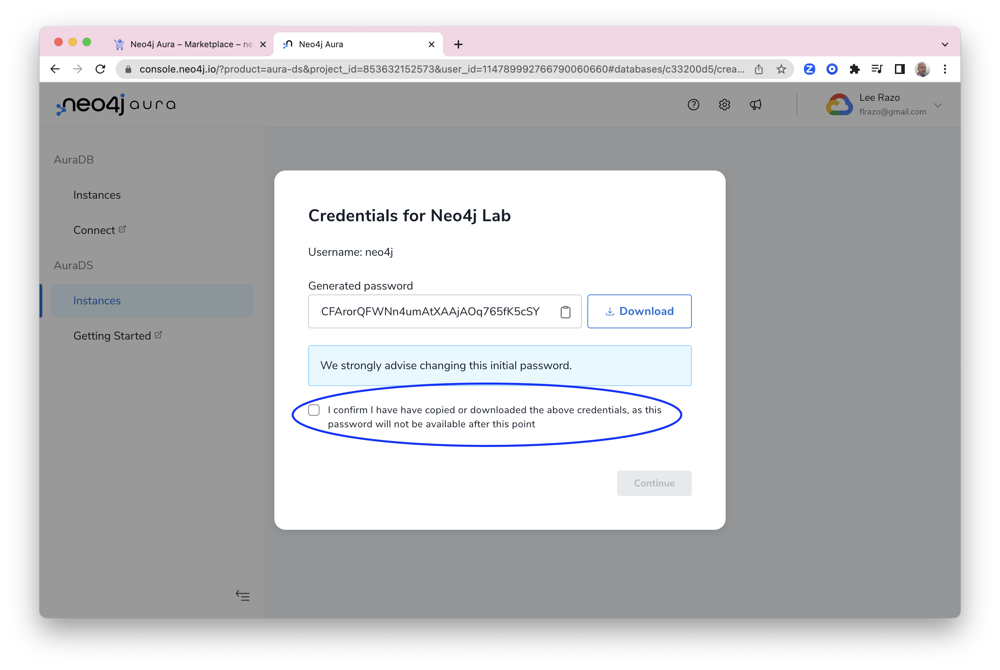

# Neo4j Hands On Lab - Creating a Graph of the London Public Transportation Network (Work in Progress)

Neo4j has three major products:
* Graph Database (GDB) - a native graph data store built from the ground up to leverage not only data but also data relationships.
* Graph Data Science (GDS) - a software platform helping data scientists uncover the connections in big data to answer business critical questions and improve predictions.
* Bloom - a graph exploration application for visually interacting with Neo4j graphs. Bloom gives graph novices and experts alike the ability to visually investigate and explore graph data from different business perspectives.

There are many ways to run these products on Google Cloud.  The Marketplace in particular offers three ways to deploy Neo4j:

* Software as a Service (SaaS) - Neo4j Aura is the lowest effort way to deploy Neo4j.  Infrastructure is managed entirely for you.  Aura is available in AuraDB (Database) and AuraDS (Data Science) versions.  DB is the core database.  DS include Bloom for Business Intelligence and Neo4j Graph Data Science.
* Infrastructure as a Service (IaaS) - Neo4j Enterprise Edition is available on IaaS with a Google Deployment Manager template.  That allow you to choose whether you would like a single node or cluster.  It allows configuration of Graph Database, Bloom and Graph Data Science.
* Platform as a Service (PaaS) - This is an option to deploy Graph Database on Kubernetes.

You can inspect these options [here](https://console.cloud.google.com/marketplace/browse?q=neo4j).

## Deploying AuraDS Professional
We're going to use the SaaS version, AuraDS in these labs.  This is sometimes refered to as a database as a service (DBaaS).  Aura comes in a number of flavors.  There's an enterprise and a professional version.  We're going to deploy the professional version.  

So, let's get started deploying...  To do so, let's go to the Google Cloud console [here](https://console.cloud.google.com/).  If it's not already open, click the hamburger icon in the upper left to expand the menu.

On the left menu, scroll to the bottom and click "MORE PRODUCTS."

Still in the left menu, scroll all the way to the bottom.  You'll see listings for a number of partner products.  These are products from leading ISVs that Google has chosen to integrate tightly into the Cloud Consonle.  Amoung those, you'll see a listing for Neo4j.  Click on that.

That takes you to a description of Neo4j Aura Professional. Go to the project selector dropdown on the upper left and select the project "neo4j-lab". 

If you don't see this project available on the list, give the lab administrator your Google Cloud account email address to add you to the project. 

Now you should see a pair of buttons to manage Neo4j Aura. If you don't, refresh your browser and/or double check you have selected the "neo4j-lab" project.

Click on the blue "Manage On Provider" button.

Now you have reached the Neo4j Aura management console. On the left pane go down to the AuraDS section and click on "Instances"

You should now see a blank screen with a blue button that says "New Instance". Click on that to go to the instance configuration screen.

Give your instnace a name, for example "Neo4j Lab". 
Leave the region set to "Europe"
For "Number of Nodes" enter 500,000
For "Number of Relationships" enter 1,000,000

Scroll down and under "Which algorithms are you going to use" select:
-  Centrality & Importance
-  Community Detection
-  Pathfinding & Search

Scroll down and click the "Calculate Estimate" button.

Once that is finished, scroll down a bit further. It has now recommended an instance size based on your inputs. Click on "Create Instance"

Save the credentials file somewhere where you can access it later and select the confirmation box, you'll need this later to access the instance once it is ready. 

It will take a few minutes for the instance to deploy. Once it's ready it will have a green dot next to the word "Ready" 

Click on the "Query" button to login to the browser console. 

Login now using the credentials downloaded in an earlier step

In the browser query box type **:server change-password** to set the password to something more memorable.

    :server change-password 

